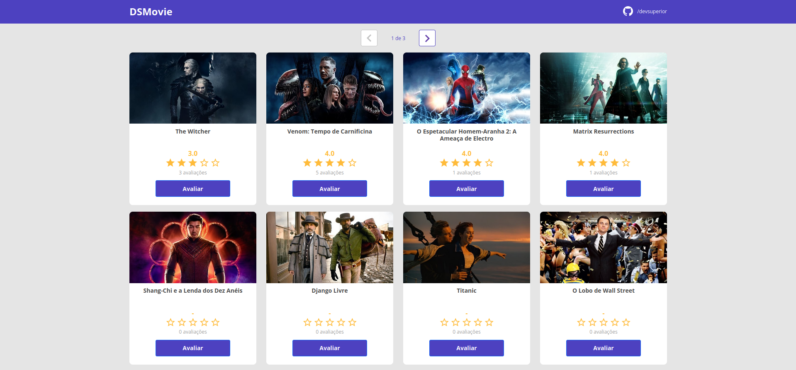
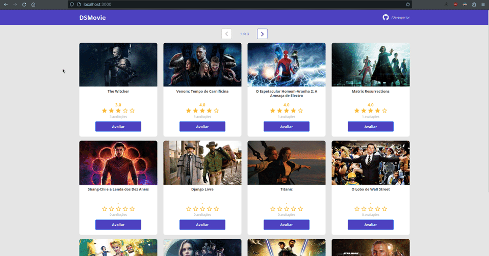

<h1 align="center"><b> DSMovie</b></h1>

<div align="center">


</div>

<h1 align="center"></h1>

## About 📚

The **DSMovie** project was developed through the **8th Edition of DevSuperior's Spring React Week** event. During the course, the basic concepts of the **Spring framework** were covered in the construction of endpoints of a **Rest API** in the **backend** and the **React** base in the composition of the **frontend**, putting everything into practice in the development of this project, **DSMovie**. A fictional service that rates and lists movies.


## Technologies & Languages Used 🚀

- **Java**
- **Spring**
- **Maven**
- **JPA**
- **H2 Database**
- **React JS**
- **TypeScript**
- **Axios**

Auxiliary dependencies can be found at: [dependencies](https://github.com/lucasferreiraz/dsmovie/network/dependencies).


## Layout 🔖

The design of the **DSMovie** project was based on the prototype made in the **Figma** tool. The browser file can be accessed below.
- **[Project Design File](https://www.figma.com/file/mt3o98SME4m7DlDgyEAp4W/DSMovie?t=eSDnHyanfkflsdAx-0)**


## Endpoints 🔗

For this project three endpoints were designed (click to expand): <br>

<details>

<summary><b>Show Movies:</b> <code>GET localhost/movies</code></summary>

## Show Paginated Movies List

Returns an object containing a paginated list of the first 12 sellers for each page.

**Method** : `GET`

**URL** : `localhost/movies`

### OR

**URL** : `http://localhost:8080/movies?size=12&page=${pageNumber}&sort=id`

## Success Response

**Code** : `200 OK`

**Content example:**

```json
{
    "content": [
        {
            "id": 1,
            "title": "The Witcher",
            "score": 3.0,
            "count": 3,
            "image": "https://www.themoviedb.org/t/p/w533_and_h300_bestv2/jBJWaqoSCiARWtfV0GlqHrcdidd.jpg"
        },
        {
            "id": 2,
            "title": "Venom: Tempo de Carnificina",
            "score": 4.0,
            "count": 5,
            "image": "https://www.themoviedb.org/t/p/w533_and_h300_bestv2/vIgyYkXkg6NC2whRbYjBD7eb3Er.jpg"
        },


            "."
            "."
            "."


        {
            "id": 12,
            "title": "Star Wars: Episódio I - A Ameaça Fantasma",
            "score": 0.0,
            "count": 0,
            "image": "https://www.themoviedb.org/t/p/w533_and_h300_bestv2/36LnijfQCOC89rCMOhn2OINXROI.jpg"
        }
    ],
    "pageable": {
        "sort": {
            "empty": false,
            "sorted": true,
            "unsorted": false
        },
        "offset": 0,
        "pageNumber": 0,
        "pageSize": 12,
        "paged": true,
        "unpaged": false
    },
    "last": false,
    "totalPages": 3,
    "totalElements": 29,
    "size": 12,
    "number": 0,
    "sort": {
        "empty": false,
        "sorted": true,
        "unsorted": false
    },
    "first": true,
    "numberOfElements": 12,
    "empty": false
}
```
</details>

<details>

<summary><b>Show Movie by Id:</b> <code>GET localhost/movies/{id}</code></summary>

## Return Movie By Id

Returns an object belonging to the id passed as a parameter.

**Method** : `GET`

**URL** : `localhost/movies/{id}`

### OR

**URL** : `http://localhost:8080/movies/{id}`

## Success Response

**Code** : `200 OK`

**Content example:**

```json
{
    "id": 1,
    "title": "The Witcher",
    "score": 3.0,
    "count": 3,
    "image": "https://www.themoviedb.org/t/p/w533_and_h300_bestv2/jBJWaqoSCiARWtfV0GlqHrcdidd.jpg"
}
```
</details>

<details>

<summary><b>Save Score:</b> <code>PUT localhost/scores</code></summary>

## Save Score By Id

An object containing three fields with the following types must be provided: movieId: integer, email: string, score: double.
If there is an rating related to that email, the score is updated, if not a new score is added.

**Method** : `PUT`

**URL** : `localhost/sales/{id}/notification`

**Code** : `200 OK`

**Content example:**

```json
{
    "movieId": 1,
    "email": "lucas@gmail.com",
    "score": 3
}
```

</details>

---

## Demonstration 🖥️

**Returns a paged list of all movies saved in the database.**



**Adding a review for a specific movie.**


---

<p align="center" style="font-weight:bolder">
    Developed with 💛 by <a href="https://github.com/lucasferreiraz">Lucas Ferreira</a>
</p>